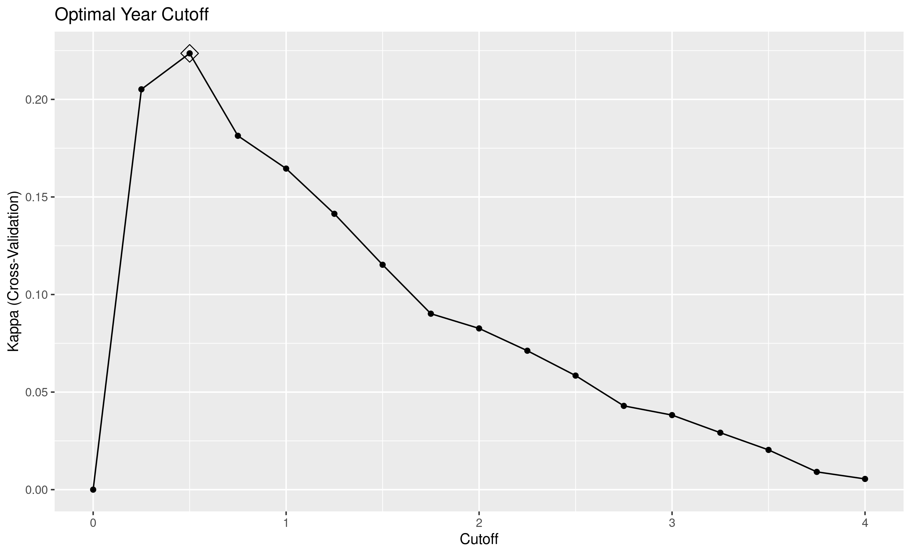
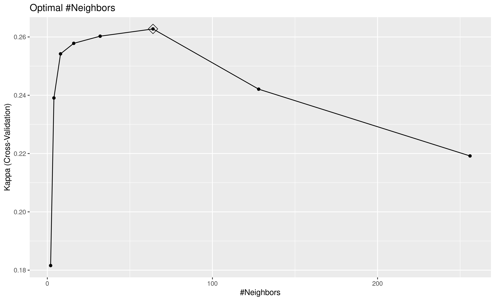

```{r setup, include=FALSE}
knitr::opts_chunk$set(echo = TRUE)
```

# Introduction

Many nonprofits depend on individual donations to power their missions. To
increase their impact on critical issues like health, hunger, and education,
these organizations must understand their donors and use resources wisely to
encourage donations. This project uses supervised machine learning techniques
to help organizations identify future donors based on highly accessible
information about past transactions.

The project uses anonomized donor data from DonorsChoose to train three models:
a simple heuristic, a logistic regression model, an a K nearest neighbors (KNN)
model. Each model predicts whether or not individual donors will donate again
in the next year based on previous donation activity. After training the
models, the paper compares performance metrics and discusses the merits of each
model.

The paper finds that machine learning techniques can improve even simple
decision rules by basing them on empirical observations rather that gut
instinct. Using more sophisticated algorithms, it is possible to substantially
increase prediction specificity for better overall performance. The top
performing KNN model sacrifices some sensitivity for large specificity gains,
achieving overall accuracy of 0.913 on test data.

This is a capstone project for the HarvardX Professional Certificate in Data
Science.^[https://www.edx.org/professional-certificate/harvardx-data-science]
In addition to providing insight on a real business need, this effort aims to
test my understanding of machine learning's core concepts. It has been an
opportunity to practice, make mistakes, and learn from feedback. I thank my
reviewers and welcome constructive criticism.


# Analysis

## Objective and Approach

The objective for each model is to predict whether past donors will donate
again in the next year. This categorical outcome is positive for donors who
donate again within the trime frame and negative for all others.

I use 5.5 years of donation data to attack this problem. I use the first 4.5
years of data to represent past activity. These data are available for
extracting features that may predict repeat donations. I use the final year to
distinguish repeat donors from all others.

For features, I focus on three fundamental donation characteristics that are
theoretical correlates with customer or donor
engagement.^[https://en.wikipedia.org/wiki/RFM_(market_research)]

- **Recency:** The duration since the last donor interaction.
- **Frequency:** How often a donor interacts with an organization.
- **Monetary Value:** How much a donor spends on an organization.

These features are attractive for two reasons. First, there are plausible
relationships between these features and donor engagement, and by extension the
likelihood of donating again (negative for recency, positive for frequency and
monetary value). Second, they are accessible; if an organization tracks any
donor data, then they probably have the timestamps and dollar amounts necessary
to operationalize these features.

This project equally prioritizes model sensitivity and specificity. In some
contexts, it might be more important to identify likely donors and tolerate
false positives (e.g., when cleaning email lists). In other contexts,
organizations might prefer to target high likelihood donors and minimize false
postives (e.g., when offering an incentive for donating). For these reasons,
the models need a metric that balances sensitivity and specificity.

Since only about 9% of donors repeat in the following year, it is important to
use a metric that accounts for class imbalance. Cohen's Kappa achieves this
purpose.^[https://en.wikipedia.org/wiki/Cohen%27s_kappas] 
^[https://stats.stackexchange.com/questions/82162/cohens-kappa-in-plain-english]
The metric takes the following form

$$\kappa = \frac{p_o - p_e} {1 - p_e}$$

where $p_0$ is the observed proportion of correct predictions and $p_e$ is the
expected proportion of correct predictions assuming random predictions with the
distribution of predicted and true outcomes observed in the confusion matrix.
^[The Wikipedia article has a simple example.] Expressed with slightly more
formal notation, $p_e$ is

$$p(true\_positive) + p(true\_negative)$$

This term accounts for class imbalance and makes the kappa metric useful in
situations where one outcome is more common than the other. Although it is
difficult to interpret the absolute value of kappa, the relative values from
competing models can help identify top performers.

## Data and Features

This project uses anonymized donation data from
DonorsChoose^[https://www.donorschoose.org/], an educational nonprofit that
supports public school teachers. The data are publicly available on
Kaggle.^[https://www.kaggle.com/donorschoose/io]

The data include 5.5 years of individual donations from 2012 to 2018. Each
donation in the raw data includes a donor ID, a donation timestamp, and a
dollar amount among other variables. The source data include other tables
with details about donors, schools, teachers, and projects requesting funding.
Although these extra tables might have valuable information to refine
predictions, I exclude them for simplicity and generalizability.

To prepare the outcomes and features for the models, I divide the donations
into those occurring before 2017-05-01 (past donations) and those occurring
afterward (future donations). I aggregate the past donations by donor ID and
calculate the following features for recency, frequency, and monetary value:

- Duration from the last donation to the cutoff date.
- Total number of donations as of the cutoff date.
- Mean of donations as of the cutoff date.

To assign outcomes, I flag donors in the past donations set whose IDs appear
again in the future donations set. The resulting dataset includes 1.6M donors
with a 9% repeat donation rate.

I partition 90% of the data for training and 10% for final evaluation. For
faster computations, I reduced the training data to a sample of 50K donors.
^[The code includes an option to control the sample size.] Outside of the
capstone setting, it would make sense to train on the full training set for
better final performance, but this sample works for demonstration.

Exploratory data analysis suggests that time since the last donation and the
number of past donations both predict repeat donation as expected; recent
donors are more likely to still be engaged, and frequent donors are more
likely to continue donating. On the other hand, the mean donation amount does
not appear to predict future donations as strongly. Figure 1 illustrates. Note
that donation counts and amounts are on log scales.


- Tabulate t-test results.

Based on this analyis, modeling efforts focus on recency and frequency only.
This approach is appealing because it further simplifies the problem, and it
allows for visualizing model results in two dimensions.

## Models

Using the caret framework in R, I optimize and evaluate each model for Cohen's
Kappa. All models use 5-fold cross validation for parameter tuning and stable
performance metric estimates. The small number of folds suffices for this
demonstration while maintaining reasonable computation times.

During the modeling phase, I train three models of increasing complexity. The
first model, a simple heuristic, serves as a baseline for subsequent models.
The next subsections describe each of the models. The following results section
compares model performance and discusses implications.

### Baseline: Year Cutoff Heuristic

In practice, it is often easier to implement simple heuristics or decision
making rules to solve classification problems than to train machine learning
models. These rules do not require large amounts of data or special data
science knowledge to implement, and they often rely on intuitive reasoning.
Machine learning models should justify the extra implementation costs by
outperforming reasonable baseline heuristics.

For this project, the baseline heuristic categorizes all donors as repeat
donors if they have donated since a given date cutoff. This rule is easy to
understand and implement, and it responds to a pattern in the training data:
recent donors are more likely than others to repeat in the next year.

It is possible to set a cutoff by glancing at the distribution-- perhaps one
year before the past-future cutoff date of 2020-05-01. However, machine
learning techniques already present an opportunity to optimize the cutoff
parameter. After evaluating and cross-validating performance at quarterly
intervals (i.e. Three months ago, six months ago, etc.), the best cutoff
occurs at half a year ago, with a Kappa of 0.224. See figure 2.



### Logistic Regression

The second approach uses logistic regression to predict future donors based
on both recency and frequency of past donations. This approach estimates a
linear relationship between the features and the log odds of a repeat donation.
The log odds transform to probability estimates, which in turn predict repeat
donors for the probabilies over 50%.

The logistic regression model takes the following form:

$$g(p) = \beta_0 + \beta_1 years\_ago + \beta_2 n\_donations$$

where $g(p)$ is the log odds of probability $p$ that a donor will repeat.

The fitted model has coefficients with the expected signs: a negative
relationship for recency and a positive relationship for frequency.

$$g(p) = -1.195 -0.856  years\_ago + 0.017 n\_donations$$

Although this model has no hyperparameters to tune, cross validation still
provides a stabler estimate of Kappa: only 0.027. This model is much more
conservative than the baseline when it comes to identifying repeat donors.
And although it produces very few false positives (high specificity), it
produces many more false negatives (low sensitivity).

### K Nearest Neighbors

The third approach uses a K nearest neighbors (KNN) model to classify donors
based on the known classes of training cases with similar recency and
frequency values. This approach can identify clusters of repeat and
non-repeat donors that don't follow a linear pattern.

KNN models have one hyperparameter k representing the number of neighbors to
use when classifying an observation. Smaller values of k produce more granular
and idiosyncratic decision boundaries, and larger values produce smoother
boundaries. Without any guidance for reasonable k values in this domain,
I tried several orders of magnitude using powers of 2.^[R started crashing with
values greater than 256.] A k value of 64 optimized kappa at 0.263. See figure
3.




# Results

I evaluate each of the tuned models using the holdout data from the initial
partition. The following table summarizes model performance.

|Model    | Kappa| Accuracy| Sensitivity| Specificity|
|:--------|-----:|--------:|-----------:|-----------:|
|Cutoff   | 0.227|    0.809|       0.486|       0.843|
|Logistic | 0.016|    0.907|       0.009|       1.000|
|Knn      | 0.264|    0.913|       0.194|       0.988|

Using kappa as the performance metric, the KNN model performs best, followed
by the simple cutoff heuristic. Additional metrics reveal a tradeoff between
sensitivity and specificity. The logistic regression and KNN models achieve 
substantially higher specificity than the baseline at the cost of some
sensitivity. For KNN, the gains offset the costs. The model also achieved
0.913 accuracy-- a 13% improvement over the year cutoff.

Figure 4 shows the decision boundaries for each model, allowing for a richer
understanding of performance.^[Note that these plots are exclusively for
exploring post hoc results and do not inform the training process] As before,
the plots display donation counts with a log scale to counteract the skew. For
that reason the linear decision boundary for the logistic model looks curved.


Although the KNN model scored best on the evaluation metric, each model has
tradeoffs and unique properties. From left to right, the models become more
nuanced, using more features and local conditions to separate repeat donors
from non-repeat donors.

However, the models also become increasingly difficult to interpret. The
heuristic and the logistic model show that recent and frequent donors are the
best bets. The KNN model tells the same general story, but some of the pockets
in the jagged decision boundary are difficult to explain with theory.

Unlike the baseline and KNN models, the logistic regression model can produce
probability estimates in addition to class predictions. This property might be
useful if, for example, an organization was interested in targeting donors who
are on the fence about donating.

Without any more details about an organization's business needs, this analysis
suggests that the KNN model would be best for making predictions. However,
organizations might consider different models depending on their needs for
simplicity or probability estimates.


# Conclusion

These results show that machine learning techniques can help nonprofits better
identify future donors, even if that means simply refining simple decision
rules to reflect signals in the data. Nonprofits could use insights from these
models to improve their donor interactions in many ways.

- Focus limited outreach resources on likely donors.
- Target messaging to segments of likely donors.
- Identify on-the-fence donors who might need encouragement.
- Purge unlikely repeat donors from email lists to avoid spam filters.

This work can serve as a template for nonprofits. Using only time stamps from
past donation data, any organization can train similar models for their own
donor populations. They may also be able to refine these models by adding
monetary value or other context-specific features to predict future donor 
engagement (e.g., past volunteering involvement). They could also supplement
this work with models to predict how much a donor might give in the future,
thereby right-sizing donation requests in donor communications. Finally, they
could refine the models by incorporating all existing data and new data.
